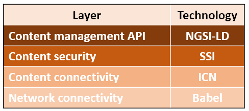

# NEXTshare
A full stack file sharing system, focusing on decentralization and security, leveraging next generation
Internet protocols and security mechanisms to provide ad-hoc content discovery and sharing using minimum
configuration.

## About
The goal of this project is to provide open-source software that can be used for decentralized file
sharing. The project will initially target Raspberry Pis connected using ad-hoc networking. This setup
emulates many emerging use cases, such as community networks, VANETs, (Aerial) MANETs.

## Architecture

As shown in the figure above, NEXTshare architecture is layered. NEXTshare's layers integrate technologies
that enable ad-hoc communication, decentralization, and secure content discovery and sharing. In particular,
NEXTshare architecture is realized using the following layers:

### Network connectivity
This layer is responsible for maintaining node connectivity in ad-hoc and mobile networks. For this purpose,
NEXTshare leverages [Babel](https://www.rfc-editor.org/rfc/rfc8966.html) routing protocol as implemented by
[babeld](https://www.irif.fr/~jch/software/babel/babeld.html). 

### Content connectivity
This layer is responsible for enabling content lookup and retrieval. In this layer NEXTshare implements
[Information Centric Networking](https://www.irtf.org/icnrg.html) (ICN) principles. In particular,
NEXTshare implements the modified Named-Data Networking architecture described in [1].

### Content security
This layer is responsible for providing content integrity and authenticity protections, as well as for
implementing access control. This layer leverages W3C's [Decentralized Identifiers](https://www.w3.org/TR/did-core/)
and [Verifiable Credentials](https://www.w3.org/TR/vc-data-model/). Related security solutions
implemented by the [SCN4NDN](https://mm.aueb.gr/scn4ndn/) project are leveraged.  

### Content management API
NEXTshare's higher layer is responsible for providing applications with an API that 
facilitates content management. This layer implements ETSI's [NGSI-LD API](https://en.wikipedia.org/wiki/NGSI-LD)
and it uses libraries and tools developed by the [SNDS](https://mm.aueb.gr/projects/snds) project.

## Team
 * Dr. Nikos Fotiou
 * Dr. Yannis Thomas

## Research
NEXTshare is based on research outcomes presented in this papers:
1. N. Fotiou, Y. Thomas, V.A. Siris, G. Xylomenos, G.C. Polyzos, "Self-verifiable content using decentralized identifiers," 
Elsevier Computer Networks, Volume 230, 2023 [pdf](https://mm.aueb.gr/publications/7c997192-418c-48b9-9b2c-cf19ebdc3a4e.pdf)
2. Y.Thomas, N. Fotiou, S. Toumpis, G.C. Polyzos, "Improving mobile ad hoc networks using hybrid IP-Information Centric Networking", 
Elsevier Computer Communications, Volume 156, pages 25-34, 2022 [pdf](http://pages.cs.aueb.gr/~thomasi/papers/2020_ComCom_HybridAdhoc.pdf)
